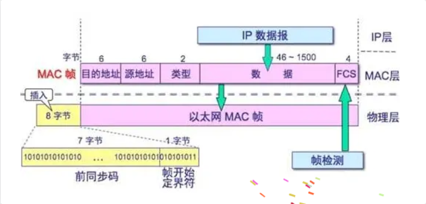

# EtherCAT 帧格式

## 参考

- [EtherCAT 数据帧结构](https://www.cnblogs.com/wsg1100/p/19867640#%E4%BA%8Cethercat-%E6%95%B0%E6%8D%AE%E5%B8%A7%E7%BB%93%E6%9E%84)
- 

## 标准 Ethernet II 帧

EtherCAT 帧封装在标准 Ethernet II 帧中：

| 字段 | 长度 | 说明 |
|------|------|------|
| Destination MAC | 6 bytes | 目的 MAC 地址 |
| Source MAC | 6 bytes | 源 MAC 地址 |
| Type | 2 bytes | 上层协议类型 |
| Payload | 46~1500 bytes | 实际数据 |
| FCS | 4 bytes | 帧校验序列 |

### Type 字段

| 值 | 协议 |
|-----|------|
| `0x0800` | IPv4 |
| `0x0806` | ARP |
| `0x86DD` | IPv6 |
| `0x88A4` | **EtherCAT** |

当 Type 字段值 **> 1536 (0x0600)** 时，表示标识上层协议，而非帧长度。

## EtherCAT 帧整体结构

```text
Ethernet II Header (14 bytes)
├── Dst MAC (6)
├── Src MAC (6)
└── Type = 0x88A4 (2)

EtherCAT Header (2 bytes)
├── Length (11 bits)
├── Reserved (1 bit)
└── Type (4 bits) = 0x1

EtherCAT Datagram(s) (一个或多个)
├── Datagram Header (10 bytes)
├── Data (0~1486 bytes)
└── Working Counter (2 bytes)
```

## EtherCAT Header

| 字段 | 位宽 | 说明 |
|------|------|------|
| Length | 11 bits | EtherCAT 数据长度 |
| Reserved | 1 bit | 保留 |
| Type | 4 bits | `0x1` = EtherCAT DLPDU |

## Datagram 格式

每个 Datagram 由 **Header + Data + Working Counter** 组成。

### Datagram Header

| 字段 | 长度 | 说明 |
|------|------|------|
| Command (Cmd) | 1 byte | 命令类型 |
| Index | 1 byte | 帧索引 |
| Address | 4 bytes | 地址（Adp + Ado / 逻辑地址） |
| Length | 2 bytes | 数据长度 |
| Interrupt | 2 bytes | 中断字段 |

其中 4 bytes 地址分为两种情况：

- **站点寻址**（如 FPWR/FPRD）：
  - Adp（Auto-increment Address）：2 bytes
  - Ado（Address Offset）：2 bytes
- **逻辑寻址**（如 LRW/LRD/LWR）：
  - 4 bytes 全部为逻辑地址

#### Index 字段

`Index` 是 Datagram 的**帧索引/序号**，用于主站识别和匹配请求与响应。

| 方向 | 行为 |
|------|------|
| 主站 → 从站 | 主站分配递增索引（0~255 循环），每个 Datagram 可不同 |
| 从站 → 主站 | 从站原样返回 Index，不修改 |

**作用**：主站通过响应中的 Index 判断这个响应对应哪个请求。

```text
主站请求:  Index = 0x01
              ↓
从站响应:  Index = 0x01  （原样返回）
```

> `Index` 不用于从站寻址，寻址由 Adp/Ado 或逻辑地址完成。

### 常见 Command 类型

| Cmd | 名称 | 说明 |
|-----|------|------|
| 0x01 | APRD | 自动增量物理读 |
| 0x02 | APWR | 自动增量物理写 |
| 0x04 | FPRD | 固定站点物理读 |
| 0x05 | FPWR | 固定站点物理写 |
| 0x07 | BRD | 广播读 |
| 0x08 | BWR | 广播写 |
| 0x09 | LRD | 逻辑读 |
| 0x0A | LWR | 逻辑写 |
| 0x0C | **LRW** | **逻辑读写** |

## Working Counter（WKC）

每个 Datagram 末尾有 2 bytes 的 Working Counter，用于主站确认从站是否成功处理：

- 请求帧中 WKC = 0
- 从站每成功处理一次该 Datagram，就按规则递增 WKC
- 主站通过比较返回值与期望值判断通信是否正常
